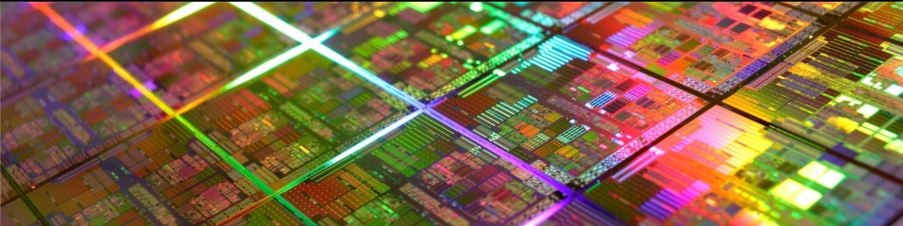

## 👋 Hello, I'm Jesús Almansa

I'm an Industrial Electronics and Automation Engineer graduated from the Polytechnic University of Valencia, and I hold a Master's in Artificial Intelligence from the International University of La Rioja. Recently, I have enrolled in a remote Computer Science degree to further expand my technical knowledge and skills.

Currently, I am actively looking for new opportunities in the field of **Artificial Intelligence, Machine Learning, and Data Science**, where I can apply my experience in **anomaly detection, satellite image analysis, and deep learning**.

I have experience developing virtual reality tools at Simumatik, contributing to the creation of virtual industrial commissioning environments. My final degree project was completed with this company, which you can check out here: [Virtual Commissioning with Virtual Reality](https://www.diva-portal.org/smash/record.jsf?pid=diva2%3A1444434&dswid=-8880).

Additionally, my background in **cybersecurity** has allowed me to integrate data science and security, optimizing decision-making in complex digital environments.

### 🧠 My Expertise:
- **Artificial Intelligence & Machine Learning**: 
  - Proficient in building models using **Deep Learning**, **Transformers**, **RNN**, and **LSTM** for tasks ranging from sequence modeling to object detection.
  - Extensive experience in developing and optimizing machine learning pipelines for various applications, including anomaly detection, classification, and regression.

- **Land Change Detection in satellite images**: 
  - Specialized in detecting land changes in **satellite imagery** and **environmental data** using the state of the art in computer vision techniques.

- **Data Science**: 
  - Skilled in **statistical analysis**, **data preprocessing**, and **feature engineering** to prepare datasets for robust model development.
  - Expertise in **model evaluation**, **performance optimization**, and using frameworks like **scikit-learn**, **TensorFlow**, and **PyTorch** to create high-performing predictive models.

- **Marine Platforms**: 
  - Experience in developing models for **monitoring and anomaly detection** in offshore wind farms using sensor data and **dynamics** simulations.
  - Utilized **surrogate models** to simulate marine environments and detect faults or anomalies in complex marine systems.
  - Developed systems for real-time anomaly detection in **offshore wind farms** and other marine platforms, ensuring operational efficiency and predictive maintenance.

- **Programming Languages**: 
  - Proficient in **Python**, **MATLAB**, and **C++** for designing algorithms, data analysis, and implementing AI models.
  - Python expertise includes popular libraries such as **NumPy**, **Pandas**, **scikit-learn**, **TensorFlow**, and **PyTorch**.

- **Open-Source Systems (Linux)**:
  - Advanced knowledge of **Linux** operating systems for development, deployment, and system administration tasks.
  - Experience in using **Linux** for creating automated workflows, running AI models on high-performance systems, and managing cloud or local development environments.

- **Containerization & Orchestration**:
  - **Docker**: Proficient in using **Docker** to create containerized applications for AI/ML models, ensuring consistency across different environments.
  - **Kubernetes**: Experience in orchestrating containerized applications using **Kubernetes**, deploying scalable and resilient AI systems in distributed environments.
  - Implemented **CI/CD pipelines** with Docker and Kubernetes to streamline development and deployment processes for machine learning models.

### 🛠 What I’m Working On:
- Building **intelligent systems** for anomaly detection in satellite images.
- Exploring new applications of **Transformers** in sequential data modeling.
- Creating datasets and models for **marine environmental monitoring**.
- Diving into **LLM** to create a very light version of ChatGPT to develop understanding on the topic

### 🎓 Ongoing Education:
- **Computer Science Degree (Remote)**: Expanding my knowledge in **software engineering, algorithms, and computer systems** to complement my AI expertise.  

### 🎓 Bootcamp & University Projects:
- **[Virtual Commissioning with Virtual Reality](https://riunet.upv.es/handle/10251/147929?show=full)**: Developed VR tools for industrial simulations.  
- **[Satellite Image Analysis for Anomaly Detection]**: Built deep learning models for land change monitoring.  
- **[Customer Churn Prediction]**: Applied ML to forecast customer churn during my **Ironhack Bootcamp**.  
- **[Movie Recommendation System]**: Developed a collaborative and content-based filtering system.  

### ⚙️ Personal Projects:
- **[Marine Wind Platform Anomaly Detection]**: Built real-time models for monitoring offshore wind farms.  
- **[CNN-Based Image Classification]**: Developed a deep learning model using **CIFAR-10** dataset.  
- **[NLP Sentiment Analysis]**: Applied natural language processing to analyze and classify sentiments.  
- **[Telegram Bot Development]**: Created a Telegram bot for automated responses and integrations.  
- **[Rebranding of Transportes Fernández]**: Developed a complete rebranding project, including a fully functional **React-based website**.  
- **[Containerized Applications with Docker]**: Series of projects focusing on **containerization**, improving deployment and scalability using **Docker** and **Kubernetes**.

### 📫 Get in Touch:
Feel free to reach out through.

  
  

### 📊 GitHub Stats:

<!--  -->
