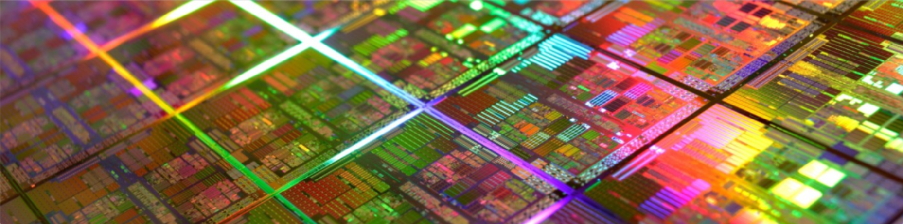

## 👋 Hello, I'm Jesús Almansa

I'm an Industrial Electronics and Automation Engineer graduated from the Polytechnic University of Valencia, and I hold a Master's in Artificial Intelligence from the International University of La Rioja. Currently, I work as an AI Engineer at HI Iberia, where I develop innovative solutions using machine learning and deep learning to tackle complex challenges, such as detecting anomalies in offshore wind platforms and land change detection with satellite image analysis.

I also have experience in developing virtual reality tools at Simumatik, where I contributed to the creation of virtual industrial commissioning environments. I had the opportunity to complete my final degree project with this company, which you can check out here [Virtual Commissioning with Virtual Reality](https://www.diva-portal.org/smash/record.jsf?pid=diva2%3A1444434&dswid=-8880).

Throughout my career, I've worked in cybersecurity, which has allowed me to effectively integrate data, AI, and security knowledge to optimize decision-making in increasingly complex digital environments.

### 🧠 My Expertise:
- **Artificial Intelligence & Machine Learning**: 
  - Proficient in building models using **Deep Learning**, **Transformers**, **RNN**, and **LSTM** for tasks ranging from sequence modeling to object detection.
  - Extensive experience in developing and optimizing machine learning pipelines for various applications, including anomaly detection, classification, and regression.

- **Land Change Detection in satellite images**: 
  - Specialized in detecting land changes in **satellite imagery** and **environmental data** using the state of the art in computer vision techniques.

- **Data Science**: 
  - Skilled in **statistical analysis**, **data preprocessing**, and **feature engineering** to prepare datasets for robust model development.
  - Expertise in **model evaluation**, **performance optimization**, and using frameworks like **scikit-learn**, **TensorFlow**, and **PyTorch** to create high-performing predictive models.

- **Marine Platforms**: 
  - Experience in developing models for **monitoring and anomaly detection** in offshore wind farms using sensor data and **dynamics** simulations.
  - Utilized **surrogate models** to simulate marine environments and detect faults or anomalies in complex marine systems.
  - Developed systems for real-time anomaly detection in **offshore wind farms** and other marine platforms, ensuring operational efficiency and predictive maintenance.

- **Programming Languages**: 
  - Proficient in **Python**, **MATLAB**, and **C++** for designing algorithms, data analysis, and implementing AI models.
  - Python expertise includes popular libraries such as **NumPy**, **Pandas**, **scikit-learn**, **TensorFlow**, and **PyTorch**.

- **Open-Source Systems (Linux)**:
  - Advanced knowledge of **Linux** operating systems for development, deployment, and system administration tasks.
  - Experience in using **Linux** for creating automated workflows, running AI models on high-performance systems, and managing cloud or local development environments.

- **Containerization & Orchestration**:
  - **Docker**: Proficient in using **Docker** to create containerized applications for AI/ML models, ensuring consistency across different environments.
  - **Kubernetes**: Experience in orchestrating containerized applications using **Kubernetes**, deploying scalable and resilient AI systems in distributed environments.
  - Implemented **CI/CD pipelines** with Docker and Kubernetes to streamline development and deployment processes for machine learning models.

### 💼 Current Role:
I am currently working as an AI Engineer for **HI Ibiera**, where I develop and deploy advanced algorithms for **satellite image analysis** and **offshore platform monitoring**. My role involves improving the detection of terrain changes and identifying potential anomalies in marine wind farms.

### 🛠 What I’m Working On:
- Building **intelligent systems** for anomaly detection in satellite images.
- Exploring new applications of **Transformers** in sequential data modeling.
- Creating datasets and models for **marine environmental monitoring**.
- Diving into **LLM** to create a very light version of ChatGPT to develop understanding on the topic

### 📚 University Projects:
- **[Virtual Commissioning with Virtual Reality](https://riunet.upv.es/handle/10251/147929?show=full)**: Developed tools in **Virtual Reality** to simulate and optimize industrial commissioning processes at **Simumatik**.
- **[Satellite Image Analysis for Anomaly Detection]**: Built models using **deep learning** techniques to detect anomalies in satellite images for land change monitoring.

### 💻 Bootcamp Projects:
- **[Customer Churn Prediction]**: Developed a machine learning model to predict customer churn using **Python**, **scikit-learn**, and **Pandas** during my **Ironhack Bootcamp**.
- **[Sales Forecasting Project]**: Created a forecasting model using **time-series analysis** to predict sales trends.
- **[Movie Recommendation System]**: Built a recommendation system using **collaborative filtering** and **content-based filtering** for a streaming service dataset.

### ⚙️ Personal Projects:
- **[Marine Wind Platform Anomaly Detection]**: Developed an anomaly detection system using **sensor data** from marine wind platforms to detect operational issues.
- **[Image Classification with CNNs]**: Built a **Convolutional Neural Network (CNN)** to classify images from the **CIFAR-10** dataset.
- **[NLP Sentiment Analysis]**: Applied **NLP techniques** to analyze and predict the sentiment of movie reviews.

### 📫 Get in Touch:
Feel free to reach out through.

  
  

### 📊 GitHub Stats:

<!--  -->
